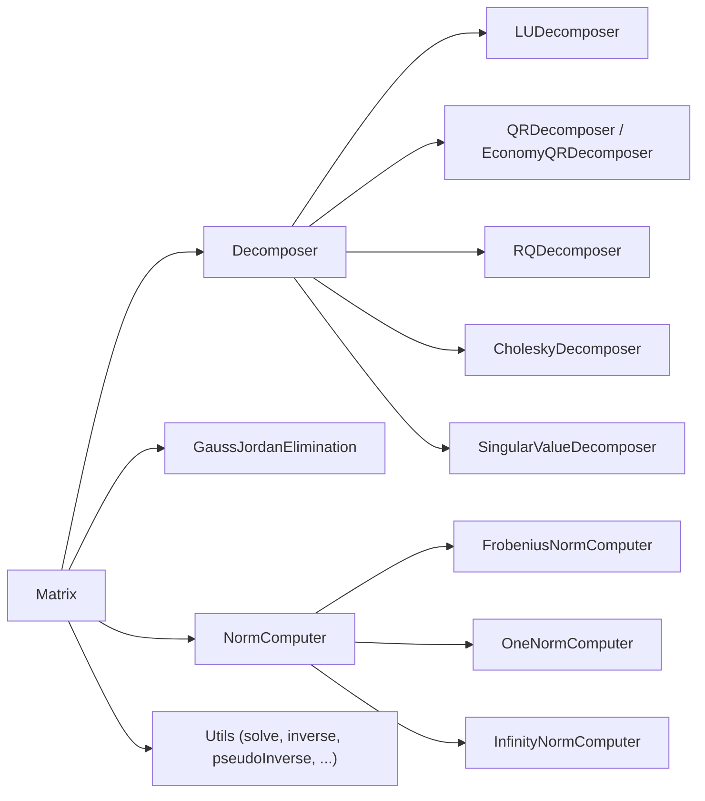

# irurueta-algebra

🧮 **Irurueta Algebra** is a lightweight Java library for matrix algebra.

It provides a dense `Matrix` class with the usual arithmetic operations, a family of matrix
decomposers (LU, QR, Economy QR, RQ, Cholesky, Singular Value), and utility classes to solve
linear systems of equations, invert or pseudo-invert matrices, and compute vector and matrix
norms.

[](https://github.com/albertoirurueta/irurueta-algebra/actions)
[](https://github.com/albertoirurueta/irurueta-algebra/actions)

[](https://sonarcloud.io/dashboard?id=albertoirurueta_irurueta-algebra)
[](https://sonarcloud.io/dashboard?id=albertoirurueta_irurueta-algebra)
[](https://sonarcloud.io/dashboard?id=albertoirurueta_irurueta-algebra)

[](https://sonarcloud.io/dashboard?id=albertoirurueta_irurueta-algebra)
[](https://sonarcloud.io/dashboard?id=albertoirurueta_irurueta-algebra)

[](https://sonarcloud.io/dashboard?id=albertoirurueta_irurueta-algebra)
[](https://sonarcloud.io/dashboard?id=albertoirurueta_irurueta-algebra)
[](https://sonarcloud.io/dashboard?id=albertoirurueta_irurueta-algebra)

[](https://sonarcloud.io/dashboard?id=albertoirurueta_irurueta-algebra)
[](https://sonarcloud.io/dashboard?id=albertoirurueta_irurueta-algebra)
[](https://sonarcloud.io/dashboard?id=albertoirurueta_irurueta-algebra)

## ✨ Features

- `Matrix`: a dense matrix of `double` values with arithmetic operations (`add`, `subtract`,
  `multiply`, `multiplyByScalar`, `multiplyKronecker`, `elementByElementProduct`), `transpose`,
  sub-matrix extraction/insertion, and factory methods (`identity`, `diagonal`,
  `createWithUniformRandomValues`, `createWithGaussianRandomValues`).
- Matrix decomposers: `LUDecomposer`, `QRDecomposer`, `EconomyQRDecomposer`, `RQDecomposer`,
  `CholeskyDecomposer` and `SingularValueDecomposer`, plus `GaussJordanElimination`.
- Norm computers: `FrobeniusNormComputer`, `OneNormComputer` and `InfinityNormComputer`.
- `Utils`: static helpers for `trace`, `det`, `rank`, `cond`, `solve`, `inverse`,
  `pseudoInverse`, norms, `isSymmetric`, `isOrthogonal`, `crossProduct` and `skewMatrix`.
- Most decomposition algorithms are based on _Numerical Recipes, 3rd Edition_, chapter 2.
- Only runtime dependency: `com.irurueta:irurueta-statistics`.



## 🚦 Project status

- Latest release: `1.4.0`
- Current development version: `1.5.0-SNAPSHOT`
- Java target: Java 21
- Build system: Maven
- License: Apache License 2.0
- Quality checks: GitHub Actions, JaCoCo, Surefire, and SonarCloud

## 📚 Documentation

- [Project documentation](https://albertoirurueta.github.io/irurueta-algebra/)
- [Javadoc report](https://albertoirurueta.github.io/irurueta-algebra/mvn-site/apidocs/index.html)
- [JaCoCo coverage report](https://albertoirurueta.github.io/irurueta-algebra/mvn-site/jacoco/index.html)
- [Surefire test report](https://albertoirurueta.github.io/irurueta-algebra/mvn-site/surefire.html)
- [Maven site report](http://albertoirurueta.github.io/irurueta-algebra/mvn-site)
- [SonarCloud dashboard](https://sonarcloud.io/dashboard?id=albertoirurueta_irurueta-algebra)

The Antora documentation source lives in [`docs/modules/ROOT`](docs/modules/ROOT).

## 📦 Installation

### Maven

For a released dependency, pin the version you want to use. Example:

```xml
<dependency>
    <groupId>com.irurueta</groupId>
    <artifactId>irurueta-algebra</artifactId>
    <version>1.4.0</version>
</dependency>
```

For local development against the current repository snapshot:

```xml
<dependency>
    <groupId>com.irurueta</groupId>
    <artifactId>irurueta-algebra</artifactId>
    <version>1.5.0-SNAPSHOT</version>
</dependency>
```

### Gradle

```kotlin
dependencies {
    implementation("com.irurueta:irurueta-algebra:1.4.0")
}
```

## 🚀 Quick examples

### Create a matrix

```java
import com.irurueta.algebra.Matrix;

// 3x2 matrix initialized to zero
Matrix m = new Matrix(3, 2);
m.setElementAt(0, 0, 1.0);
m.setElementAt(1, 0, 2.0);

// 3x3 identity matrix
Matrix identity = Matrix.identity(3, 3);

// column matrix built from an array
Matrix column = Matrix.newFromArray(new double[]{1.0, 2.0, 3.0});
```

### Solve a linear system of equations

```java
import com.irurueta.algebra.Utils;

Matrix a = new Matrix(2, 2);
a.setElementAt(0, 0, 2.0);
a.setElementAt(0, 1, 1.0);
a.setElementAt(1, 0, 1.0);
a.setElementAt(1, 1, 3.0);

Matrix b = Matrix.newFromArray(new double[]{5.0, 10.0});

Matrix x = Utils.solve(a, b);
```

### Decompose a matrix (LU)

```java
import com.irurueta.algebra.LUDecomposer;

LUDecomposer decomposer = new LUDecomposer(a);
decomposer.decompose();

Matrix l = decomposer.getL();
Matrix u = decomposer.getU();
double determinant = decomposer.determinant();
```

### Invert or pseudo-invert a matrix

```java
Matrix inverse = Utils.inverse(a);
Matrix pseudoInverse = Utils.pseudoInverse(a);
```

### Compute norms, rank and condition number

```java
double frobenius = Utils.normF(a);
double one = Utils.norm1(a);
double infinity = Utils.normInf(a);

int rank = Utils.rank(a);
double condition = Utils.cond(a);
```

More detailed examples for every algorithm are available in the
[project documentation](https://albertoirurueta.github.io/irurueta-algebra/).

## 🛠️ Build from source

Clone the repository and run Maven:

```bash
git clone https://github.com/albertoirurueta/irurueta-algebra.git
cd irurueta-algebra
mvn test
```

Useful commands:

```bash
mvn test          # run unit tests
mvn package       # build the JAR and generate JaCoCo coverage
mvn site          # generate Maven site reports
```

To build the Antora documentation locally:

```bash
cd docs
npx antora antora-playbook.yml
```

## 🧮 Supported algorithms

| Class | Purpose |
| --- | --- |
| `GaussJordanElimination` | Solves linear systems and computes matrix inverses with full pivoting. |
| `LUDecomposer` | `A = L·U` factorization with partial pivoting; solving, determinant, inversion. |
| `CholeskyDecomposer` | `A = L·Lᵗ` factorization for symmetric positive-definite matrices. |
| `QRDecomposer` | `A = Q·R` factorization via Gram-Schmidt orthogonalization. |
| `EconomyQRDecomposer` | `A = Q·R` factorization via Householder reflections. |
| `RQDecomposer` | `A = R·Q` factorization, built on top of `QRDecomposer`. |
| `SingularValueDecomposer` | `A = U·S·Vᵗ` factorization; rank, range, nullspace, pseudoinverse. |
| `FrobeniusNormComputer` | Frobenius (Euclidean) norm of a vector or matrix. |
| `OneNormComputer` | One norm (maximum column sum) of a vector or matrix. |
| `InfinityNormComputer` | Infinity norm (maximum row sum) of a vector or matrix. |
| `Utils` | Static helpers built on top of the classes above. |

## 🤝 Contributing

Issues and pull requests are welcome.
Before submitting a change, run:

```bash
mvn test
```

For changes affecting documentation, also run:

```bash
cd docs
npx antora antora-playbook.yml
```

## 📄 License

This project is licensed under the [Apache License 2.0](https://www.apache.org/licenses/LICENSE-2.0).
